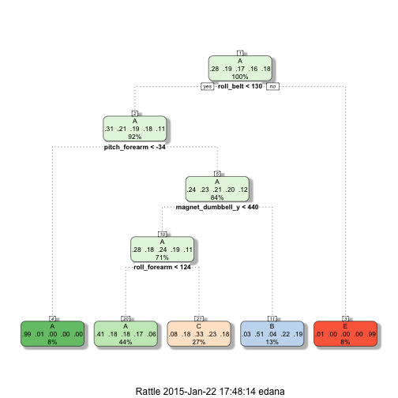

# Practical Machine Learning Prediction Assigment

## Summary

The assigment for this class uses data collected by devices such as Jawbone Up, Nike FuelBand, and Fitbit about personal activity. This measurements are used to improve users health, to find patterns in their behavior. In this project, we are going to use the data from accelerometers on the belt, forearm, arm, and dumbell of 6 participants. They were asked to perform barbell lifts correctly and incorrectly in 5 different ways. 

The goal of this project is to predict the way in which they did the exercise. Using the "classe" variable in the training set. At the end the analysis should use the prediction model to predict 20 different test cases. 

## Data collection 

The training data for this project was collecting from here: 

<https://d396qusza40orc.cloudfront.net/predmachlearn/pml-training.csv>

The test data was collecting from here: 

<https://d396qusza40orc.cloudfront.net/predmachlearn/pml-testing.csv>

The data for this project come from this source: <http://groupware.les.inf.puc-rio.br/har>. 


```r
#Load the training and testing data treating empty values as NA
training <- read.csv("/Users/edana/Data_Fitbit/pml-training.csv", na.strings=c("NA",""))
testing <- read.csv("/Users/edana/Data_Fitbit/pml-testing.csv", na.strings=c("NA",""))
```

## Analysis
The main variable that we are interersted in is Class which gives the classification according how was performed the excersise:
- **A:** Exactly according to the specification.
- **B:** Throwing the elbows to the front.
- **C:** Lifting the dumbbell only halfway. 
- **D:** Lowering the dumbbell only halfway. 
- **E:** Throwing the hips to the front.

The idea is with the data collected predict if the activity is performed correctly.

There are many columns that are empty that have to ve cleaned to be able to have the ones that really represent the features in our problem.


```r
#Clean data from NA columns
features <- training[,colSums(is.na(training))<1]
testing <- testing[,colSums(is.na(testing))<1]

#The first 2 columns don't have useful information
features <- features[,8:60]
testing1 <- testing[,8:60]
```

It is important to check for covariates that have virtually no variablility.

```r
nzv <- nearZeroVar(features, saveMetrics=TRUE)
nzv
```

```
##                      freqRatio percentUnique zeroVar   nzv
## roll_belt                1.102       6.77811   FALSE FALSE
## pitch_belt               1.036       9.37723   FALSE FALSE
## yaw_belt                 1.058       9.97350   FALSE FALSE
## total_accel_belt         1.063       0.14779   FALSE FALSE
## gyros_belt_x             1.059       0.71348   FALSE FALSE
## gyros_belt_y             1.144       0.35165   FALSE FALSE
## gyros_belt_z             1.066       0.86128   FALSE FALSE
## accel_belt_x             1.055       0.83580   FALSE FALSE
## accel_belt_y             1.114       0.72877   FALSE FALSE
## accel_belt_z             1.079       1.52380   FALSE FALSE
## magnet_belt_x            1.090       1.66650   FALSE FALSE
## magnet_belt_y            1.100       1.51870   FALSE FALSE
## magnet_belt_z            1.006       2.32902   FALSE FALSE
## roll_arm                52.338      13.52563   FALSE FALSE
## pitch_arm               87.256      15.73234   FALSE FALSE
## yaw_arm                 33.029      14.65702   FALSE FALSE
## total_accel_arm          1.025       0.33636   FALSE FALSE
## gyros_arm_x              1.016       3.27693   FALSE FALSE
## gyros_arm_y              1.454       1.91622   FALSE FALSE
## gyros_arm_z              1.111       1.26389   FALSE FALSE
## accel_arm_x              1.017       3.95984   FALSE FALSE
## accel_arm_y              1.140       2.73672   FALSE FALSE
## accel_arm_z              1.128       4.03629   FALSE FALSE
## magnet_arm_x             1.000       6.82397   FALSE FALSE
## magnet_arm_y             1.057       4.44399   FALSE FALSE
## magnet_arm_z             1.036       6.44685   FALSE FALSE
## roll_dumbbell            1.022      83.78351   FALSE FALSE
## pitch_dumbbell           2.277      81.22516   FALSE FALSE
## yaw_dumbbell             1.132      83.14137   FALSE FALSE
## total_accel_dumbbell     1.073       0.21914   FALSE FALSE
## gyros_dumbbell_x         1.003       1.22821   FALSE FALSE
## gyros_dumbbell_y         1.265       1.41678   FALSE FALSE
## gyros_dumbbell_z         1.060       1.04984   FALSE FALSE
## accel_dumbbell_x         1.018       2.16594   FALSE FALSE
## accel_dumbbell_y         1.053       2.37489   FALSE FALSE
## accel_dumbbell_z         1.133       2.08949   FALSE FALSE
## magnet_dumbbell_x        1.098       5.74865   FALSE FALSE
## magnet_dumbbell_y        1.198       4.30129   FALSE FALSE
## magnet_dumbbell_z        1.021       3.44511   FALSE FALSE
## roll_forearm            11.589      11.08959   FALSE FALSE
## pitch_forearm           65.983      14.85577   FALSE FALSE
## yaw_forearm             15.323      10.14677   FALSE FALSE
## total_accel_forearm      1.129       0.35674   FALSE FALSE
## gyros_forearm_x          1.059       1.51870   FALSE FALSE
## gyros_forearm_y          1.037       3.77637   FALSE FALSE
## gyros_forearm_z          1.123       1.56457   FALSE FALSE
## accel_forearm_x          1.126       4.04648   FALSE FALSE
## accel_forearm_y          1.059       5.11161   FALSE FALSE
## accel_forearm_z          1.006       2.95587   FALSE FALSE
## magnet_forearm_x         1.012       7.76679   FALSE FALSE
## magnet_forearm_y         1.247       9.54031   FALSE FALSE
## magnet_forearm_z         1.000       8.57711   FALSE FALSE
## classe                   1.470       0.02548   FALSE FALSE
```
It seems that all the variables have some contribution. 

## Models

Its important to try a couple of models to see is the prediction is accurate.

### Classification tree

The basic model by default will be:

```r
set.seed(123)
modFit <- train(features$classe ~ ., data = features, method="rpart")
print(modFit, digits=3)
```

```
## CART 
## 
## 19622 samples
##    52 predictor
##     5 classes: 'A', 'B', 'C', 'D', 'E' 
## 
## No pre-processing
## Resampling: Bootstrapped (25 reps) 
## 
## Summary of sample sizes: 19622, 19622, 19622, 19622, 19622, 19622, ... 
## 
## Resampling results across tuning parameters:
## 
##   cp      Accuracy  Kappa   Accuracy SD  Kappa SD
##   0.0357  0.507     0.3596  0.0176       0.0268  
##   0.0600  0.423     0.2195  0.0661       0.1101  
##   0.1152  0.337     0.0792  0.0399       0.0607  
## 
## Accuracy was used to select the optimal model using  the largest value.
## The final value used for the model was cp = 0.0357.
```


```r
print(modFit$finalModel, digits=3)
```

```
## n= 19622 
## 
## node), split, n, loss, yval, (yprob)
##       * denotes terminal node
## 
##  1) root 19622 14000 A (0.28 0.19 0.17 0.16 0.18)  
##    2) roll_belt< 130 17977 12400 A (0.31 0.21 0.19 0.18 0.11)  
##      4) pitch_forearm< -34 1578    10 A (0.99 0.0063 0 0 0) *
##      5) pitch_forearm>=-34 16399 12400 A (0.24 0.23 0.21 0.2 0.12)  
##       10) magnet_dumbbell_y< 440 13870  9950 A (0.28 0.18 0.24 0.19 0.11)  
##         20) roll_forearm< 124 8643  5130 A (0.41 0.18 0.18 0.17 0.061) *
##         21) roll_forearm>=124 5227  3500 C (0.077 0.18 0.33 0.23 0.18) *
##       11) magnet_dumbbell_y>=440 2529  1240 B (0.032 0.51 0.043 0.22 0.19) *
##    3) roll_belt>=130 1645    14 E (0.0085 0 0 0 0.99) *
```


```r
library(rattle)
fancyRpartPlot(modFit$finalModel)
```

 

Now that we have the model we are able to test it in the testing set:


```r
predictions <- predict(modFit, newdata = features)
print(confusionMatrix(predictions, features$classe), digits=4)
```

```
## Confusion Matrix and Statistics
## 
##           Reference
## Prediction    A    B    C    D    E
##          A 5080 1581 1587 1449  524
##          B   81 1286  108  568  486
##          C  405  930 1727 1199  966
##          D    0    0    0    0    0
##          E   14    0    0    0 1631
## 
## Overall Statistics
##                                           
##                Accuracy : 0.4956          
##                  95% CI : (0.4885, 0.5026)
##     No Information Rate : 0.2844          
##     P-Value [Acc > NIR] : < 2.2e-16       
##                                           
##                   Kappa : 0.3407          
##  Mcnemar's Test P-Value : NA              
## 
## Statistics by Class:
## 
##                      Class: A Class: B Class: C Class: D Class: E
## Sensitivity            0.9104  0.33869  0.50468   0.0000  0.45218
## Specificity            0.6339  0.92145  0.78395   1.0000  0.99913
## Pos Pred Value         0.4970  0.50850  0.33040      NaN  0.99149
## Neg Pred Value         0.9468  0.85310  0.88225   0.8361  0.89008
## Prevalence             0.2844  0.19351  0.17440   0.1639  0.18382
## Detection Rate         0.2589  0.06554  0.08801   0.0000  0.08312
## Detection Prevalence   0.5209  0.12889  0.26638   0.0000  0.08383
## Balanced Accuracy      0.7721  0.63007  0.64431   0.5000  0.72565
```

The results are 0.4956 accurate. So we should try to improve the model, including in this case pre-processing and cross validation.


```r
modFit1 <- train(features$classe ~ .,  preProcess=c("center", "scale"), trControl=trainControl(method = "cv", number = 4), data = features, method="rpart")
print(modFit1, digits=3)
```

```
## CART 
## 
## 19622 samples
##    52 predictor
##     5 classes: 'A', 'B', 'C', 'D', 'E' 
## 
## Pre-processing: centered, scaled 
## Resampling: Cross-Validated (4 fold) 
## 
## Summary of sample sizes: 14717, 14717, 14717, 14715 
## 
## Resampling results across tuning parameters:
## 
##   cp      Accuracy  Kappa   Accuracy SD  Kappa SD
##   0.0357  0.500     0.3474  0.0103       0.0137  
##   0.0600  0.428     0.2293  0.0704       0.1190  
##   0.1152  0.325     0.0618  0.0468       0.0714  
## 
## Accuracy was used to select the optimal model using  the largest value.
## The final value used for the model was cp = 0.0357.
```


```r
predictions1 <- predict(modFit1, newdata = features)
print(confusionMatrix(predictions1, features$classe), digits=4)
```

```
## Confusion Matrix and Statistics
## 
##           Reference
## Prediction    A    B    C    D    E
##          A 5080 1581 1587 1449  524
##          B   81 1286  108  568  486
##          C  405  930 1727 1199  966
##          D    0    0    0    0    0
##          E   14    0    0    0 1631
## 
## Overall Statistics
##                                           
##                Accuracy : 0.4956          
##                  95% CI : (0.4885, 0.5026)
##     No Information Rate : 0.2844          
##     P-Value [Acc > NIR] : < 2.2e-16       
##                                           
##                   Kappa : 0.3407          
##  Mcnemar's Test P-Value : NA              
## 
## Statistics by Class:
## 
##                      Class: A Class: B Class: C Class: D Class: E
## Sensitivity            0.9104  0.33869  0.50468   0.0000  0.45218
## Specificity            0.6339  0.92145  0.78395   1.0000  0.99913
## Pos Pred Value         0.4970  0.50850  0.33040      NaN  0.99149
## Neg Pred Value         0.9468  0.85310  0.88225   0.8361  0.89008
## Prevalence             0.2844  0.19351  0.17440   0.1639  0.18382
## Detection Rate         0.2589  0.06554  0.08801   0.0000  0.08312
## Detection Prevalence   0.5209  0.12889  0.26638   0.0000  0.08383
## Balanced Accuracy      0.7721  0.63007  0.64431   0.5000  0.72565
```

### Random forest

Another model than we can use is random forest


```r
set.seed(123)
modFit2 <- train(features$classe ~ ., method="rf", preProcess=c("center", "scale"), trControl=trainControl(method = "cv", number = 4), data=features)
print(modFit2, digits=3)
```

```
## Random Forest 
## 
## 19622 samples
##    52 predictor
##     5 classes: 'A', 'B', 'C', 'D', 'E' 
## 
## Pre-processing: centered, scaled 
## Resampling: Cross-Validated (4 fold) 
## 
## Summary of sample sizes: 14717, 14717, 14716, 14716 
## 
## Resampling results across tuning parameters:
## 
##   mtry  Accuracy  Kappa  Accuracy SD  Kappa SD
##    2    0.994     0.992  0.000857     0.00108 
##   27    0.993     0.991  0.001423     0.00180 
##   52    0.987     0.984  0.003217     0.00407 
## 
## Accuracy was used to select the optimal model using  the largest value.
## The final value used for the model was mtry = 2.
```


```r
predictions2 <- predict(modFit2, newdata=features)
print(confusionMatrix(predictions2, features$classe), digits=4)
```

```
## Confusion Matrix and Statistics
## 
##           Reference
## Prediction    A    B    C    D    E
##          A 5580    0    0    0    0
##          B    0 3797    0    0    0
##          C    0    0 3422    0    0
##          D    0    0    0 3216    0
##          E    0    0    0    0 3607
## 
## Overall Statistics
##                                      
##                Accuracy : 1          
##                  95% CI : (0.9998, 1)
##     No Information Rate : 0.2844     
##     P-Value [Acc > NIR] : < 2.2e-16  
##                                      
##                   Kappa : 1          
##  Mcnemar's Test P-Value : NA         
## 
## Statistics by Class:
## 
##                      Class: A Class: B Class: C Class: D Class: E
## Sensitivity            1.0000   1.0000   1.0000   1.0000   1.0000
## Specificity            1.0000   1.0000   1.0000   1.0000   1.0000
## Pos Pred Value         1.0000   1.0000   1.0000   1.0000   1.0000
## Neg Pred Value         1.0000   1.0000   1.0000   1.0000   1.0000
## Prevalence             0.2844   0.1935   0.1744   0.1639   0.1838
## Detection Rate         0.2844   0.1935   0.1744   0.1639   0.1838
## Detection Prevalence   0.2844   0.1935   0.1744   0.1639   0.1838
## Balanced Accuracy      1.0000   1.0000   1.0000   1.0000   1.0000
```

This is a much veter model for our data, giving a 0.993 acurate prediction

## Conclusions

We applied two different models to the testing data to make predictions clasification trees and random forest. The first one gives a low accurate prediction and the former one gives much better prediction but takes much longer time to process. 

The results applied to the testing data with the random forest model are:

```r
# Run against the testing set provided 
print(predict(modFit2, newdata=testing2))
```

```
##  [1] B A B A A E D B A A B C B A E E A B B B
## Levels: A B C D E
```
The out of sample error with tht random forest model with preprocessing and cross validation gives (1 - .9714) = 0.0286


##References

Velloso, E.; Bulling, A.; Gellersen, H.; Ugulino, W.; Fuks, H. Qualitative Activity Recognition of Weight Lifting Exercises. Proceedings of 4th International Conference in Cooperation with SIGCHI (Augmented Human '13) . Stuttgart, Germany: ACM SIGCHI, 2013.
